# Analog Synthesizer Project

---

## Demo Video

  <iframe
    src="https://www.youtube.com/embed/kVt6d5Q3_-w"
    title="Analog Synthesizer Project Demo"
    style="position:absolute; top:0; left:0; width:100%; height:100%;"
    frameborder="0"
    allow="accelerometer; autoplay; clipboard-write; encrypted-media; gyroscope; picture-in-picture; web-share"
    allowfullscreen>
  </iframe>

---

### Project Overview

This project consists of an analog synthesizer with a Voltage Controlled Oscillator (VCO), a Voltage Controlled Filter (VCF) and a Voltage Controlled Amplifier (VCA) all designed to accept Control Voltages (CV) from microcontrollers.

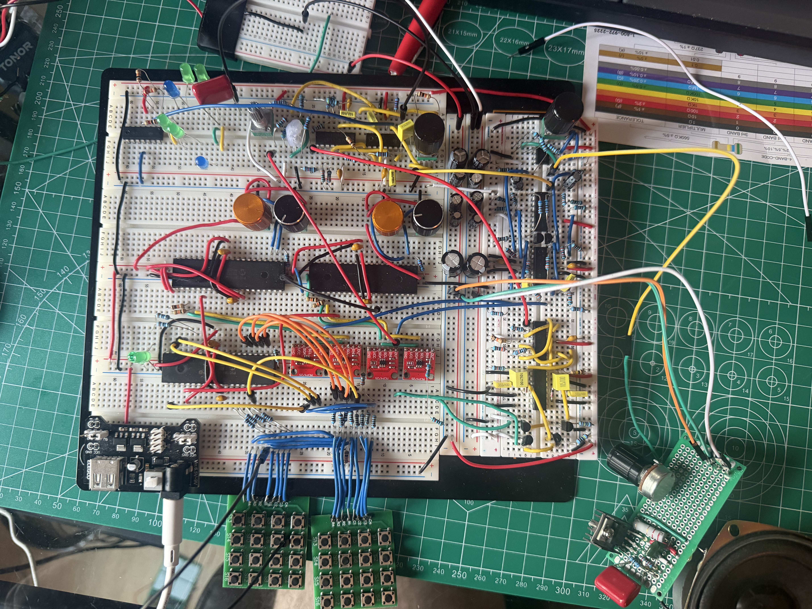

## Full Schematic

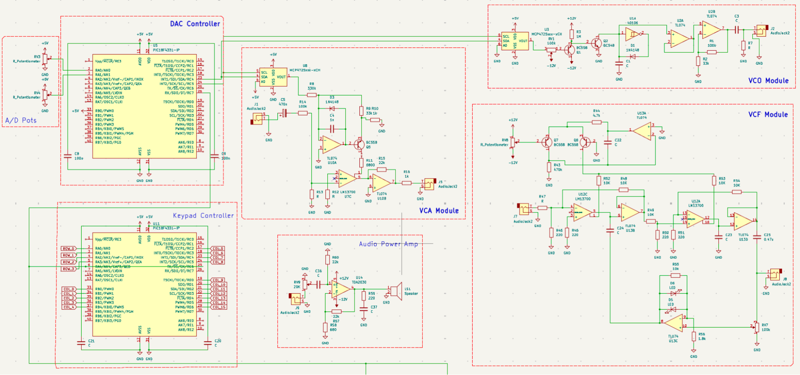

## VCO schematic
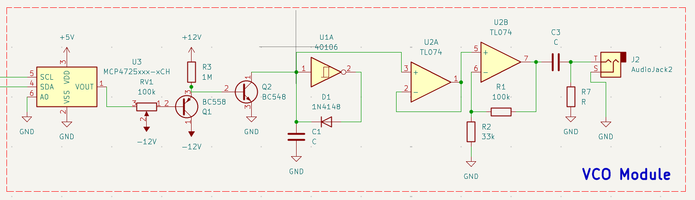

## VCF Schematic
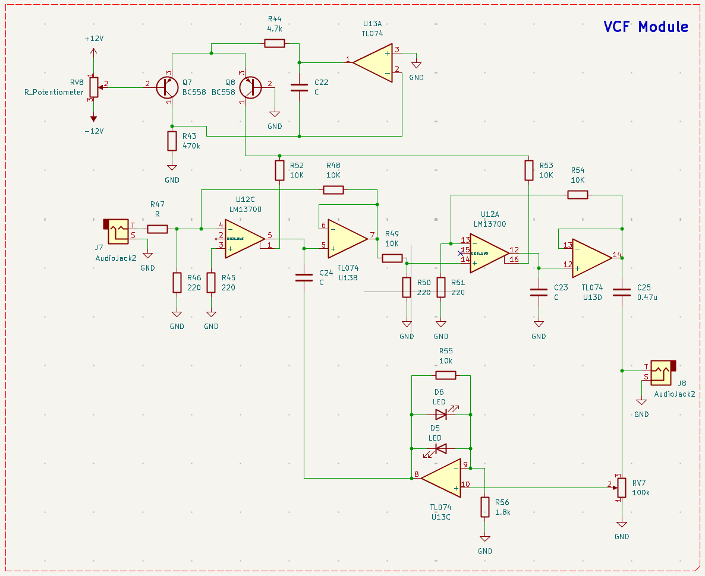

## VCA Schematic
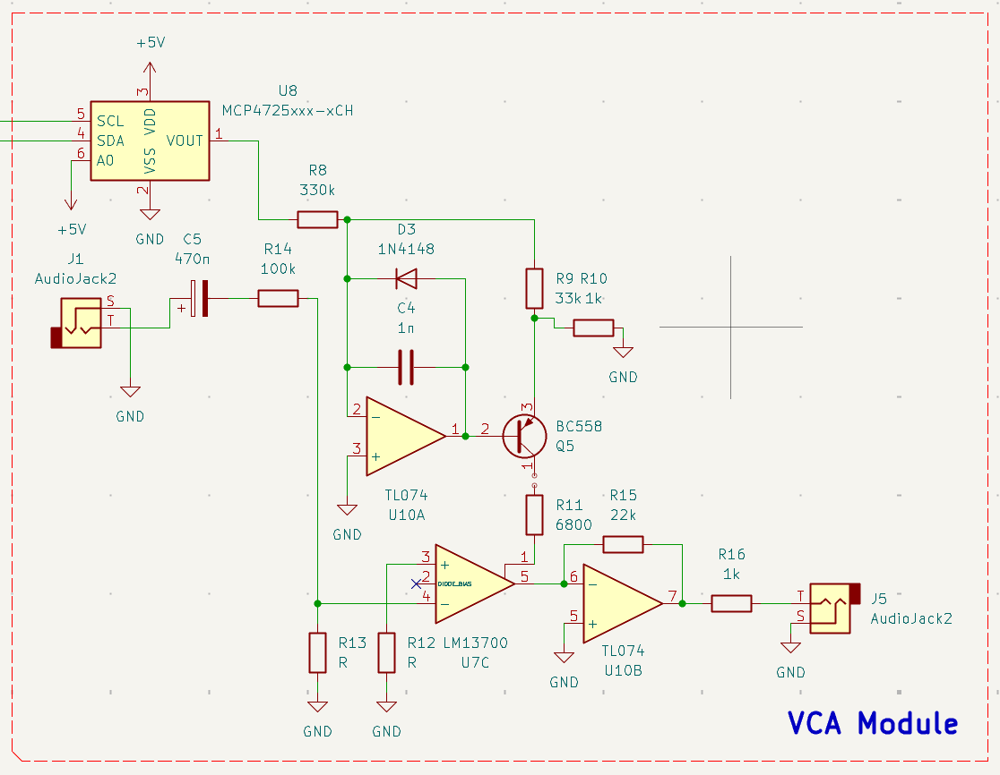

---

## Attack / Decay 
Attack and Decay represent the time related control voltages of the VCF and VCA which are calculated and transmitted by the microcontroller using external DAC modules.
Attack indicates how fast the filter or amplifier opens when a key is pressed and decay is for how fast they close when the button is released.

### Fast Attack, Fast Decay
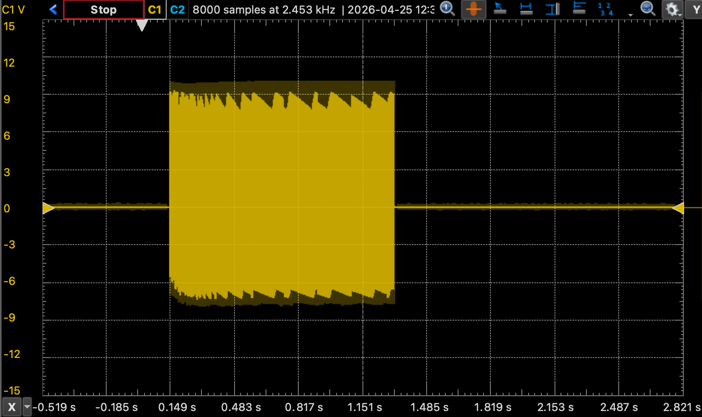

### Long Attack, Fast Decay
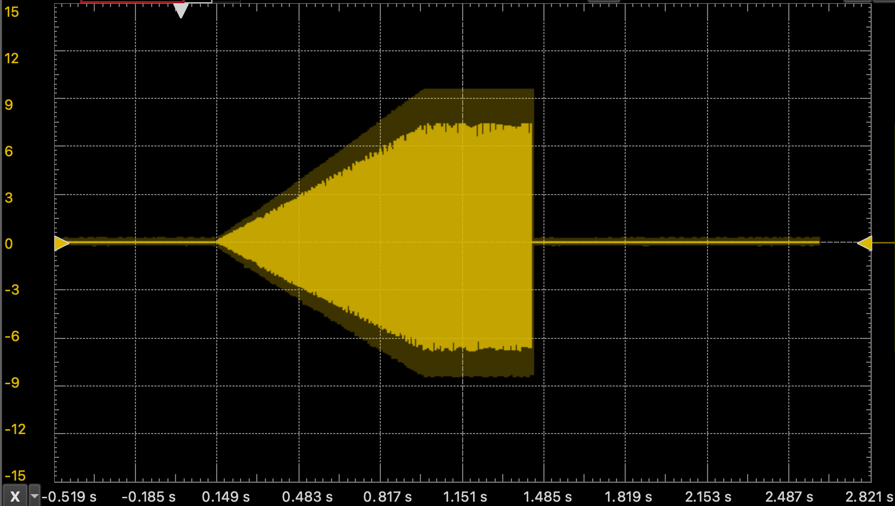

### Fast Attack, Long Decay
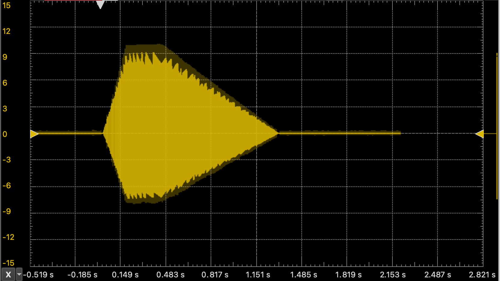

### Long Attack, Long Decay.
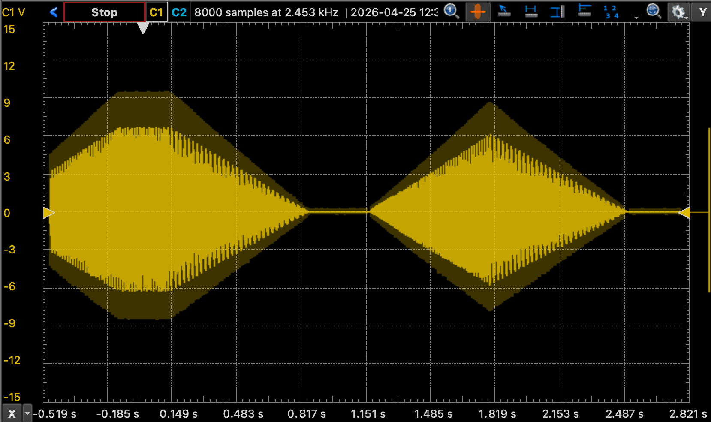

## Filter Resonance

In order to fulfill the intended "organic" characteristics of the synthesizer, the VCF uses a complex of different colored diodes in its feedback loop that introduce soft clipping determined by the forward voltage of the diodes. The diodes make the sound warmer, and the resonance introduced creates fun rubber band styled sounds.

### No Resonance
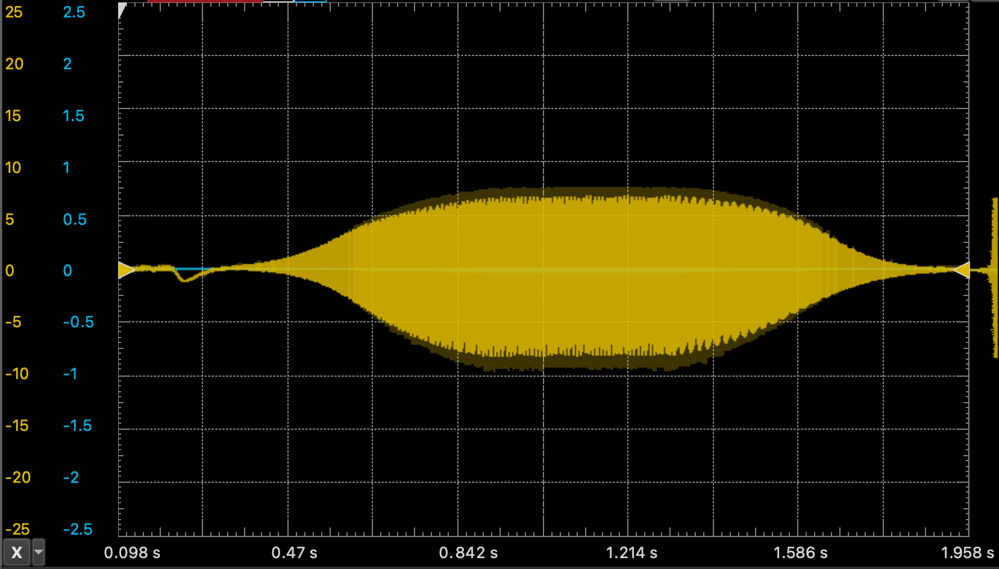

### Resonance
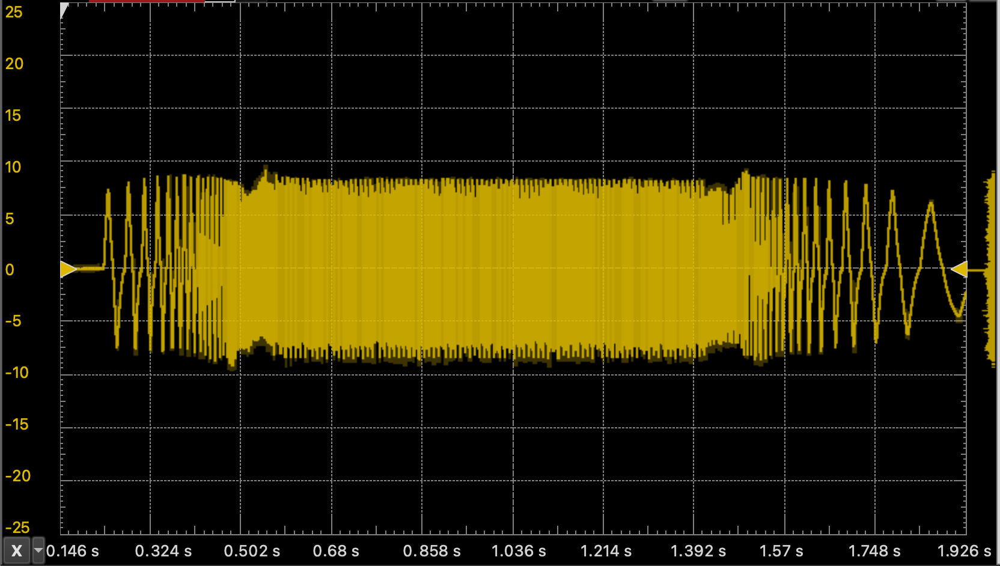

**Notice how the shape of the sound without the filter produces hard trapezoidal waveforms. Adding the VCF smooths this out, reducing the "buzzier" sound of a sawtooth, and with full resonance transforming it into pseudo-sinosoidal waves.
